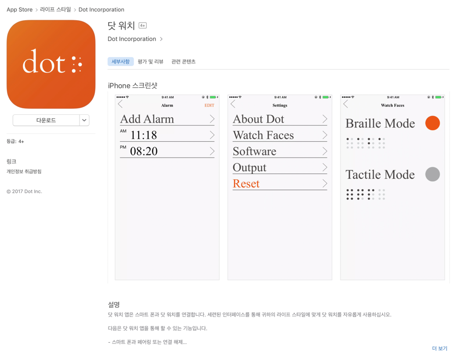
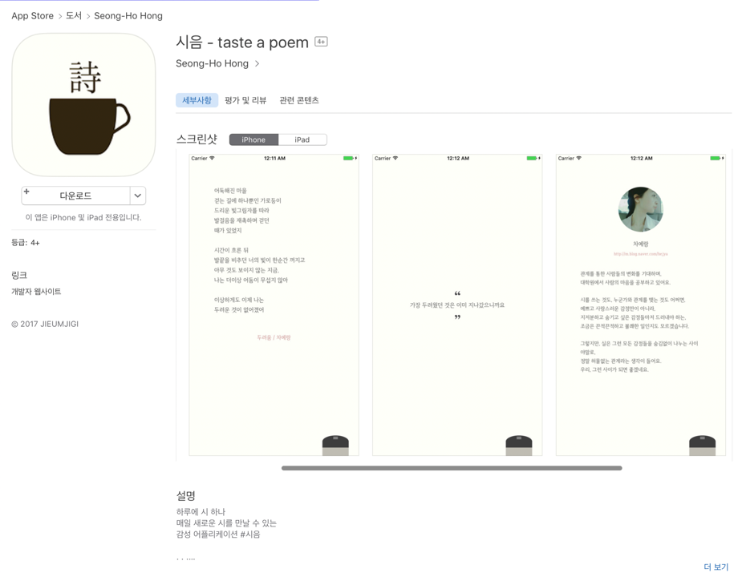
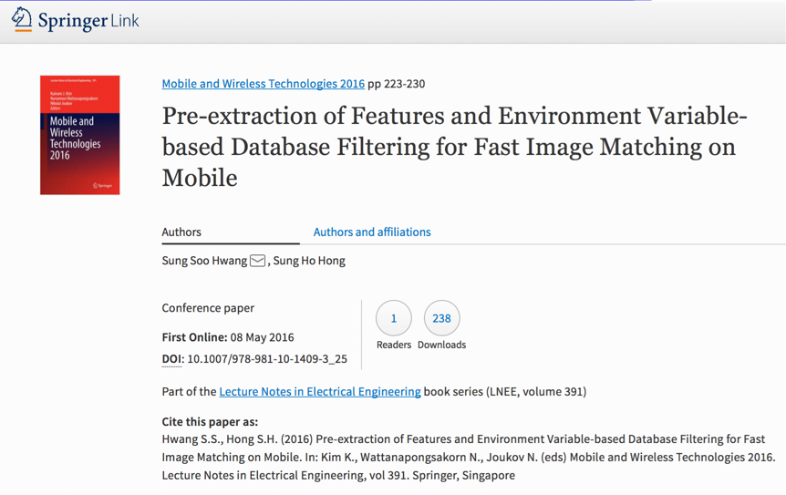

# Resume
* Email: hsh3592@gmail.com
* Blog: https://medium.com/@hongseongho

## 경력
### Naver
* 네이버 카페 iOS 앱 개발
* 2017.12.18 ~ 현재

### Dot incorporatoin
* 스마트워치 연동 iOS 앱 개발
* 2016.06.23 ~ 2017.06.23

## 프로젝트

### 네이버 카페 iOS
* 레거시 코드를 유지보수 하고 개선하는 업무를 주로 했습니다.
* 설계 원칙과 디자인 패턴을 공부해야겠다는 필요성을 더욱 느꼈습니다.
* MVVM 패턴을 이용한 테이블뷰 라이브러리 제작: [MVVM 공부하면서 번역한 자료](https://medium.com/@hongseongho/%EC%A0%95%EB%A6%AC-better-user-and-developer-experiences-from-windows-forms-to-wpf-with-mvvm-a381a26837d)
* URL 스킴을 라우팅 해주는 라이브러리 제작
* 쿠키 관리 문제 해결을 위해 라이브러리 기여
* 선언형 프로그래밍 주제로 발표: [관련내용](https://medium.com/@hongseongho/%EC%84%A0%EC%96%B8%ED%98%95-%ED%94%84%EB%A1%9C%EA%B7%B8%EB%9E%98%EB%B0%8D-%EC%95%8C%EC%95%84%EB%B3%B4%EA%B8%B0-1d8247342f17) 
* CocoaPods 신입 대상으로 강의 [관련내용](https://medium.com/@hongseongho/cocoapods-%EC%82%AC%EC%9A%A9%EB%B2%95%EA%B3%BC-%ED%8C%8C%EC%9D%BC%EA%B5%AC%EC%A1%B0-c0ea2ef362d6)

### Dot App iOS
1) 진행기간: 2016.06 ~ 2017.6
2) 주요내용: 점자 스마트워치 연동 iOS 앱 개발
3) 본인이 공헌한 점(본인의 역할): 기획, iOS 앱 개발
4) 사용한 Skill 또는 지식: Objective-C, Swift
5) 결과/성과
* 앱스토어: https://itunes.apple.com/us/app/dot-watch/id1180412560?mt=8

### Dot Watch BLE Test App
1) 진행기간: 2016.10 ~ 2017.6
2) 주요내용: 점자 스마트워치 기능검사 앱 개발
3) 본인이 공헌한 점(본인의 역할): Android 앱 개발
4) 사용한 Skill 또는 지식: java
5) 결과/성과: 생산 라인에서 사용

### 시음
1) 진행기간: 2017.02 ~ 2018
2) 내용: 하루 하나씩 아마추어 시인들의 창작물 공유 ( 시음 - taste a poem )
3) 본인이 공헌한 점(본인의 역할): 프로젝트 매니저, 기획, iOS 앱 개발
4) 사용한 Skill 또는 지식: Swift
5) 결과/성과
* 앱스토어: https://appsto.re/kr/g_Hhib.i
* 페이스북 페이지: https://www.facebook.com/tasteapoem/
* github: https://github.com/jieumjigi

### 시각장애인을 위한 신문앱
1) 진행기간: 2016.02 ~ 2016.04
2) 본인이 공헌한 점(본인의 역할): 프로젝트 매니저, 기획, Android 앱 개발
3) 사용한 Skill 또는 지식: Android
4) 결과/성과: 소외된 90%를 위한 경진대회 최우수상
* 발표자료: https://www.slideshare.net/SeongHoHong5/90-76374493
* 신문: http://www.kyongbuk.co.kr/?mod=news&act=articleView&idxno=938608 
* 신문2: http://www.kyongbuk.co.kr/?mod=news&act=articleView&idxno=960634

### 특징점 매칭을 통한 현재 위치 파악 및 장소 안내
1) 진행기간: 2015.06 ~ 2016.06
2) 본인이 공헌한 점(본인의 역할): 프로젝트 매니저, 기획, iOS 앱 개발, 서버 개발
3) 사용한 Skill 또는 지식: C++, OpenCV, Objecitvice-C, PHP
4) 결과/성과
* 슬라이드: https://www.slideshare.net/SeongHoHong5/provide-place-information-based-on-image-matching
* 동영상: https://youtu.be/LHiU0SOGXUA
* 논문 1: https://www.slideshare.net/SeongHoHong5/ss-76374458
* 논문 2: https://www.slideshare.net/SeongHoHong5/ss-76374848
* 논문 3: https://www.slideshare.net/SeongHoHong5/ss-76374416
* 해외논문: https://link.springer.com/chapter/10.1007%2F978-981-10-1409-3_25

### 카메라가 고정된 영상에서 배경 추출 및 움직이는 물체 파악
1) 진행기간: 2015.09 ~ 2015.11
2) 주요내용: 카메라가 고정된 영상에서 배경 추출 및 움직이는 물체 파악 
3) 사용한 Skill 또는 지식: C++, OpenCV, 영상처리
4) 결과/성과
* 배경 추출: https://youtu.be/OWjNM8IMv9U
* 움직이는 물체 추출: https://youtu.be/3gjhBg3IN6w
* 결과: https://youtu.be/QT_vZu3xwsU